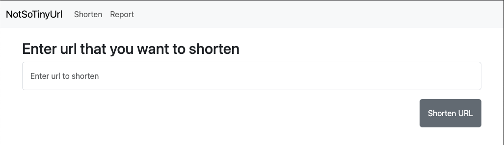
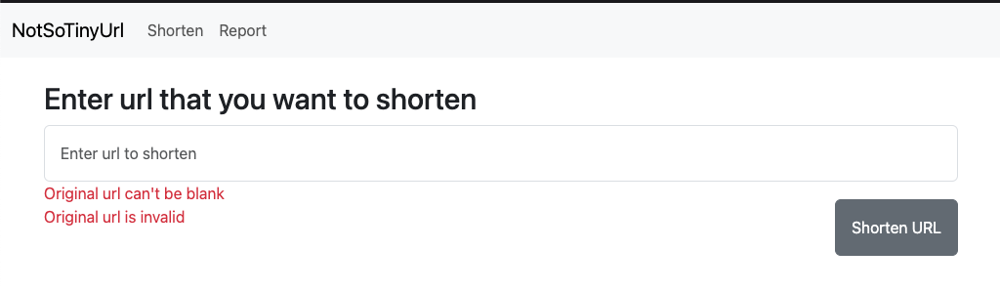
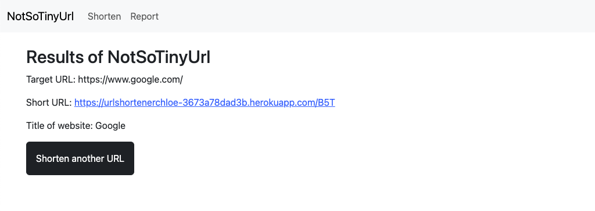
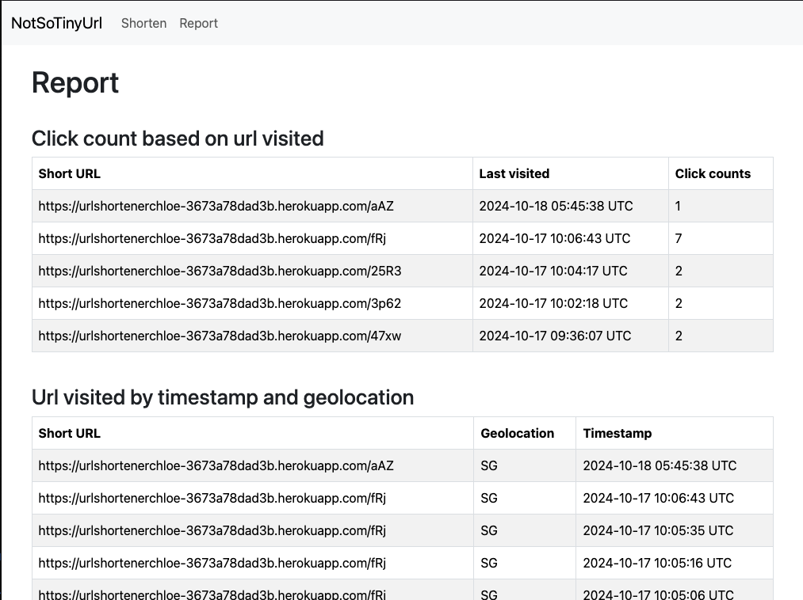

## Assignment 1: url-shortener-service
This project is a URL shortener service that allows users to shorten long URLs into more manageable, short URLs. The service is built using Ruby on Rails and uses PostgreSQL as the database. The application is containerized using Docker and can be deployed on Heroku.

Deployed link: https://urlshortenerchloe-3673a78dad3b.herokuapp.com/

## Dependencies 
- Ruby 3.3.0
- Rails 7.2.1.1
- Postgres 

## Project structure
.
├── app      
│   ├── controllers               
│   │   ├── urls_controller.rb      
│   │   └── reports_controller.rb          
│   ├── models              # business and data logic
│   │   ├── url.rb      
│   │   └── visit.rb                   
│   ├── views               # HTML templates 
│   │   ├── reports      
│   │   └── urls            
├── docs                   
├── spec                    # Tests
└── README.md               # Impt! Please read.

## Landing page / Shorten

If user tries to input an invalid url or if url is blank. A valid url contains 'http/https'

## Short url 

From here, users can take either of the three steps. 

Option 1: Shorten another url, user will be redirect back to step 1

Option 2: Upon page refresh, user will be redirected back to the landing page with this url: http://localhost:3000/urls/new

Option 3: Click on the newly generated short url with embedded link and be redirected to the original website.

## Report page 

## Installation
1. Clone the repository
2. Pull the postgresql docker image, and run the postgresql container
- `docker pull postgres:latest`
- `docker run --name url-shortener-service -e POSTGRES_USER=myuser -e POSTGRES_PASSWORD=mypassword -e POSTGRES_DB=mydatabase -d -p 5432:5432 postgres:latest`
3. Setup the database (if you're running the app for the first time, also ensure the postgres server is connected)
- `rails db:setup`
- `rails db:migrate`
4. Install the dependencies
- `bundle install`

## Running the app
1. Run the application/server - at http://localhost:3000/
- `rails s`
2. To run the tests
- `rspec`
##

### Deployment
This is app is deployed using heroku. Following this guide: https://devcenter.heroku.com/articles/getting-started-with-rails7#store-the-app-in-git

### Technical Implementation
Please refer to this https://urlshortenerchloe-3673a78dad3b.herokuapp.com/1cZc for an indepth technical writeup.

### Assignment 2 - Web core vitals
.
└── web-core-vitals
   └── 5-cwv.html       # List of issues fixed