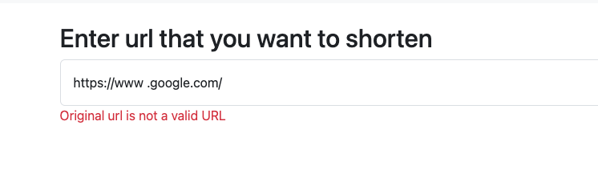
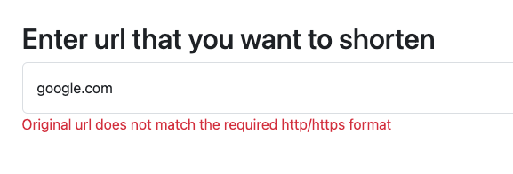
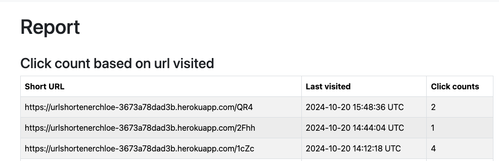
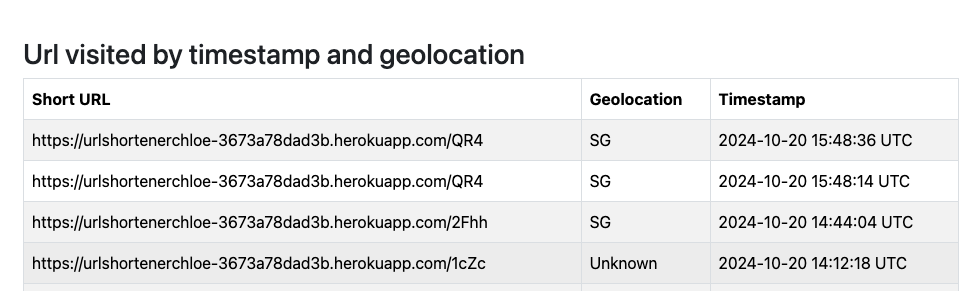

# Assignment 1: url-shortener-service
This project is a URL shortener service that allows users to shorten long URLs into more manageable, short URLs. The service is built using Ruby on Rails and uses PostgreSQL as the database. The application is containerized using Docker and can be deployed on Heroku.

Deployed link: https://urlshortenerchloe-3673a78dad3b.herokuapp.com/

## Installation
1. Clone the repository
2. Pull the postgresql docker image, and run the postgresql container
- `docker pull postgres:latest`
- `docker run --name url-shortener-service -e POSTGRES_USER=myuser -e POSTGRES_PASSWORD=mypassword -e POSTGRES_DB=mydatabase -d -p 5432:5432 postgres:latest`
3. Setup the database (if you're running the app for the first time, also ensure the postgres server is connected)
- `rails db:setup`
- `rails db:migrate`
4. Install the dependencies
- `bundle install`

## Running the app
1. Run the application/server - at http://localhost:3000/
- `rails s`
2. To run the tests
- `rspec`
##

### Technical Implementation
Please refer to this (Assignment 1) https://urlshortenerchloe-3673a78dad3b.herokuapp.com/1cZc for an indepth technical writeup.

## Dependencies 
- Ruby 3.3.0
- Rails 7.2.1.1
- Postgres 

## Project structure

- app
  - controllers: Contains the controllers for the application
    - urls_controller.rb: Controller for the URL shortening service
    - reports_controller.rb: Controller for the reports page
  - models: Contains the models for the application
    - url.rb: Model for the URL
    - visit.rb: Model for the visit
  - views: Contains the HTML templates for the application
    - reports: Contains the HTML templates for the reports page
    - urls: Contains the HTML templates for the URL shortening service
  - db: Contains the schema
- spec: Contains the tests for the application
- README.md: *IMPT* Please refer to this file for instructions on how to run the application

## Landing page / Shorten

#### Error handling
If user tries to input an a blank url. 

If user tries to input an invalid url.

If user inputs another type of invalid URL that. A valid url contains 'http/https'

## Short url 

From here, users can take either of the three steps. 

Option 1: Shorten another url, user will be redirect back to step 1

Option 2: Upon page refresh, user will be redirected back to the landing page with this url: http://localhost:3000/urls/new

Option 3: Click on the newly generated short url with embedded link and be redirected to the original website.

## Report page 

#### Click count based on url visited

#### Url visited by timestamp and geolocation

# Assignment 2 - Web core vitals
- web-core-vitals 
  - 5-cwv.html       # List of issues fixed

Details can be found in this (Assignment 2) https://urlshortenerchloe-3673a78dad3b.herokuapp.com/1cZc as well